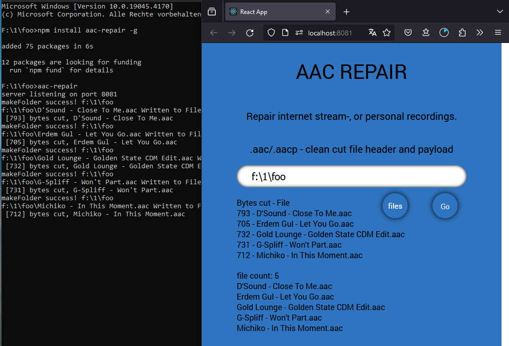

Node.js: aac-repair
===================

node.js translation and enhancement of the `Python aacRepair <https://github.com/44xtc44/aacRepair>`_ repository.

``aac-repair`` is a sound file repair tool for .aac and .aacp files. 
It reads the file header codes.

* express server terminal with React based frontend file upload
* command line support
* module import

Why?
----

Internet browser refuse to play defective aac files from local folders. 

Recorded internet or personal aac streams get a clean cut for header and payload.

``Drag and drop a file into the browser window to check``

Installation
------------

Install global to get the executable ``aac-repair``.

    npm install aac-repair -g

    npm install git+https://github.com/44xtc44/aac-repair.git -g

Usage
-----

#### OS got a User Interface (UI)

Start the Frontend and Backend. Get a Browser window.
Terminal window shows progress.

.. code-block::

    foo@bar:~$ aac-repair  // run the executable if installed global

.. code-block::

    // serverApp.js - in a local folder
    const aac = require("aac-repair");
    aac.app( {browser: true} );

.. code-block::

    foo@bar:~$ node serverApp.js

|

#### Folder

The repaired files are dumped to ``aacRepaired`` folder beneath. 

.. code-block::

    const aac = require("aac-repair");
    aac.repairAacFolder("C:\\Users\\Schtroumpfette\\sound");

#### File repair

.. code-block::

    const aac = require("aac-repair");

    async function getBytes() {
        let byteArray = await aac.readOneFile("C:\\Users\\Schtroumpfette\\sound\\damaged.aac");
        return byteArray;
    }
    
    const oneFile = async () => {  // head and tail cut
        getBytes().then((byteArray) => {
            aac.repairOneFileAac(byteArray)
              .then((repaired) => {console.log("oneFile->", repaired);});
          });
        }
        oneFile();
    
    const bodyCut = async () => {
        let byteArray = await getBytes();
        let head = await aac.repairHead(byteArray);
        let body = await aac.repairTail(head);
        console.log("bodyCut->", body);
        return body;
        }
        bodyCut();

#### File (folder) test preparation

The cut files (-1 Byte) are dumped to ``aacDamaged`` folder beneath.

.. code-block::

    const aac = require("aac-repair");
    aac.cutOneByteAacFolder("C:\\Users\\Schtroumpfette\\sound");

#### Command line Browser start

.. code-block::

    foo@bar:~$ aac-repair

Install the package in a folder.
Got to "node_modules/aac-repair" directory.
``--frontend``

.. code-block::

    foo@bar:~$ cd node_modules/aac-repair
    foo@bar:~$ node server-aac.js  --frontend

#### Command line folder repair
Install the package in a folder.
Got to "node_modules/aac-repair" directory.
``-d "path"``

.. code-block::

    foo@bar:~$ cd node_modules/aac-repair
    foo@bar:~$ node aacWorker.js -d "./repairDamagedFilesFolder"

Credit
------
Stack Overflow Website for tripwire awareness and workarounds,

Document: Recommendation ITU-R BS.1196-4(02/2015)
Audio coding for digital broadcasting 
https://www.itu.int/rec/R-REC-BS.1196/en

Document: ETSI TS 102 563 https://www.etsi.org/deliver/etsi_ts/102500_102599/102563/01.02.01_60/ts_102563v010201p.pdf

License
-------

Licensed under MIT

Copyright (c) 2024 [René Horn](https://github.com/44xtc44)